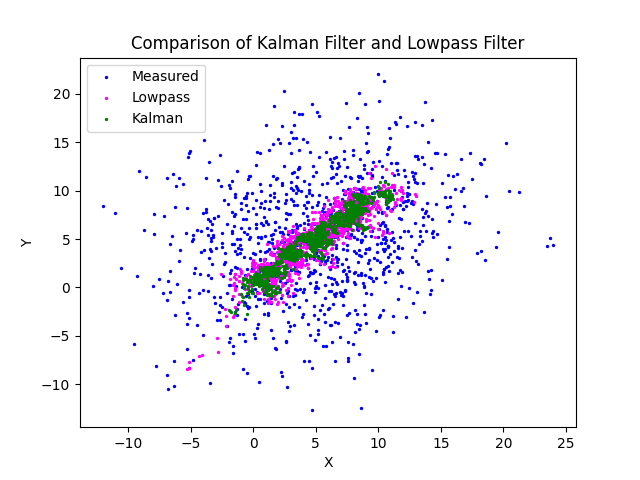
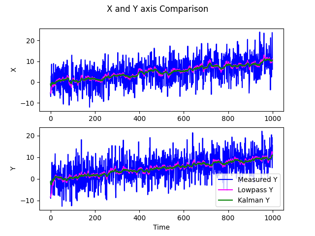

#### 任务⼀（低通滤波）
从零实现⼀个低通滤波器。
**具体步骤**
1. **设计⼀个运动模型，并在观测时加⼊高斯噪声。写⼀个C+ + 类来作为这个运动的模拟器。**
    运动模型采用匀速直线运动模型，在Simulator类中修改测量值更新方程为：`teoretical = x0 + velocity*t;`，在模拟器初始化中给定初速度，在每次循环中累加变量`t`
2. **写⼀个低通滤波器类实现对上⾯运动模拟器输出数据的滤波**
    设计了一个LowPassFilter类，实现了update方法在while循环中每次读入测量值进行低通滤波`estimate = alpha * measurement + (1.0 - alpha) * estimate;`其中alpha变量越小滤波低频选择性越好

#### 任务⼆（卡尔曼滤波）
实现对⼆维匀速运动物体的卡尔曼滤波。
1. **对比卡尔曼滤波和低通滤波的效果**
使用matplotlib-cpp实现可视化，绘制了x-y轴空间位置对比图，x-t , y-t图对比低通滤波与卡尔曼滤波的效果，分别输出在output_plot.png与XY_t.png文件中
**X-Y：**

**X-t，Y-t：**

可以发现低通滤波器与卡尔曼滤波器都对输入的测量信号进行了很好的滤波，其中卡尔曼滤波器的效果要优于简单低通滤波器